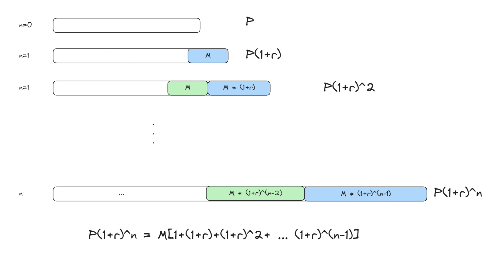

# **Frontend Mentor Challenge - Mortgage repayment calculator**

This is a solution to the [Mortgage repayment calculator challenge on Frontend Mentor](https://www.frontendmentor.io/challenges/mortgage-repayment-calculator-Galx1LXK73 "https://www.frontendmentor.io/challenges/mortgage-repayment-calculator-Galx1LXK73").

## Table of contents

- [Overview](#overview)

- [My process](#my-process)

   - [Built with](#built-with)

   - [What I learned](#what-i-learned)

      - [Mortgage repayment formula](#mortgage-repayment-formula)

- [Resources](#resources)

## Overview

Links:

- GitHub Repo: <https://github.com/xup60521/Mortgage-repayment-calculator>

- Website: <https://xup60521.github.io/Mortgage-repayment-calculator/>

```bash
# install dependencies
pnpm install
# start vite dev server
pnpm run dev
# build (output path /dist)
pnpm run build
```

## My process

### Built with

- react

- vite

- typescript

- tailwindCSS

- react-hook-form

- zod

- vitest

### What I learned

#### Mortgage repayment formula

Initial loan is $P$, monthly payment is $M$, interest rate is $r$, for a total of $n$ periods.



This eventually becomes:

$$
P(1+r)^n = M\sum_{i=1}^{i=n} (1+r)^{n-1} = M\times \frac{(1+r)^n-1}{r}
$$

Simplified to:

$$
M = P \times \frac{r(1+r)^n}{(1+r)^n-1}
$$

## Resources

- TailwindCSS Docs - <https://tailwindcss.com/docs>

- Google Fonts - <https://fonts.google.com>

- Vitest docs - <https://vitest.dev/guide/>